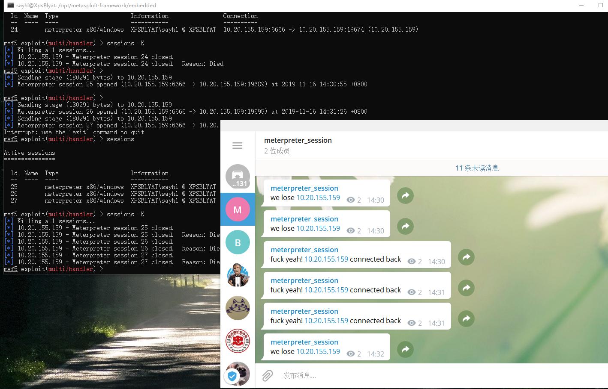

# MeterpreterTelegramNotify

git clone https://github.com/sayhi2urmom/MeterpreterTelegramNotify.git

replace token place holder with your own
replace chat_id with your own 
replace proxyaddr and proxyport with your own

copy telegramnotify.rb to /opt/metasploit-framework/embedded/framework/plugins/

load notify

start your reverse handler

notify_start

you are good to go

